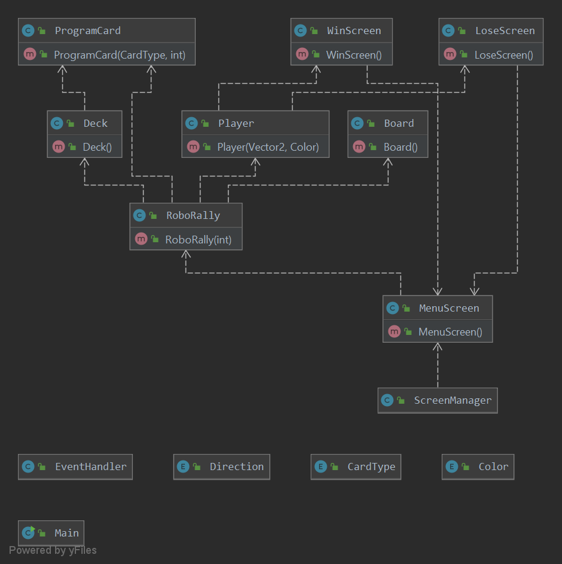

# RoboRally by aerial-stingray

## About
This repo is going to re-create the game RoboRally.

## Tests
Currently (release v1.0) the test-classes only tests for minimal functionality. This is because:
1. There is not much functionality yet implemented to be tested.
2. In order to run some tests (e.g. creating a new Player.java for a test) libGdx needs to run it's entire engine to
load graphics for the player. This is at the moment infeasible.

## UML-layout as of v1.0
