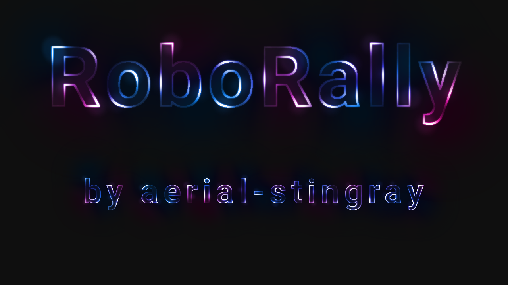
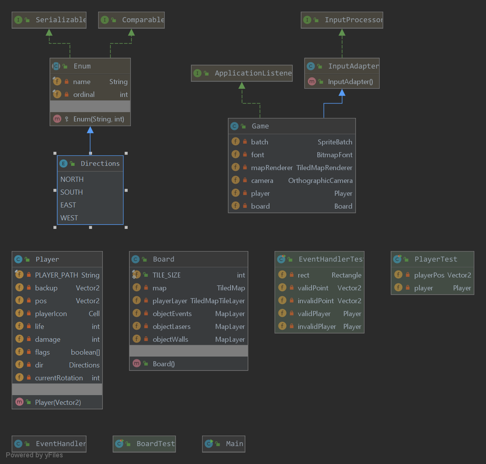

# RoboRally by aerial-stingray

## About
This repo is going to re-create the game RoboRally.

## How to play
Start by running Main. As of now, the player moves in the direction of it's feet when the up-arrow is pressed, backwards
when the down-arrow is pressed, and rotates in right or left based on whether the right or left arrow is pressed. Walk 
to the flags in order 1-4 to win the game. It will tell you in console how many flags you have, and also how many lives 
you have left.

## Tests
There are currently three test classes.

* BoardTest will check if:
    * Board.TILE_SIZE is the currently correct size of 60.

* PlayerTest will check if:
    * getPos() method gives the right position.
    * player does not have all flags from the beginning.
    * player do have all flags after the 4 flags are collected.
    * Starting direction is north.
    * Rotate left produce correct direction.
    * Rotate right produce correct direction.
    * Moving one step produce correct position.

* DirectionsTest will check if:
    * The number of directions is 4.

## UML diagram

## Thanks to :heart:
* [gdx-skins](https://github.com/czyzby/gdx-skins) by czyzby for allowing us to use cool component-skins.
    * We used the "Rusty Robot UI" created by [https://ray3k.wordpress.com/software/skin-composer-for-libgdx/](Raymond "Raeleus" Buckley)
